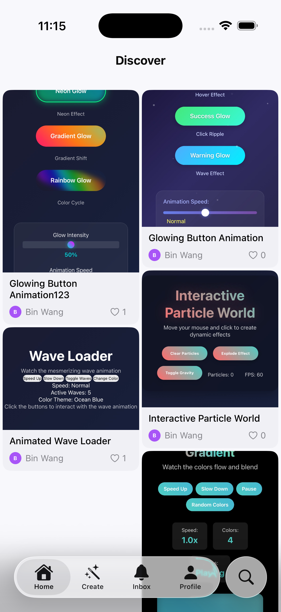
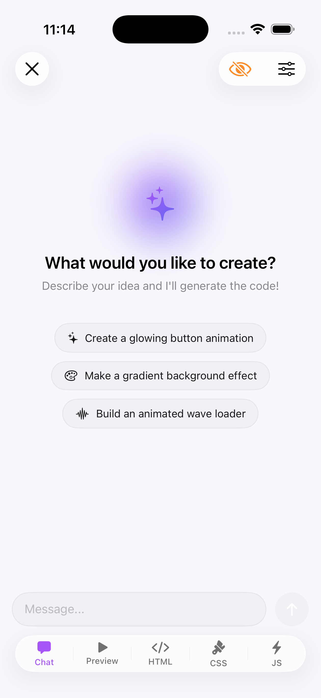
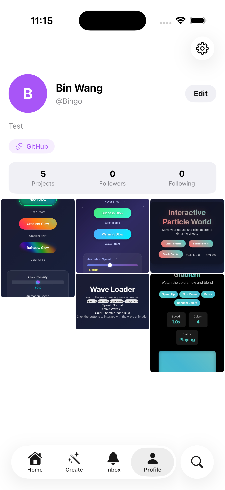

<p align="center">
  <a href="https://github.com/BingoWon/demoly-app">
    
  </a>
</p>

<h1 align="center">Demoly</h1>

<p align="center">
  <strong>Just Demo It.</strong>
</p>

<p align="center">
  说出你的想法，AI 帮你实现，分享给全世界。
</p>

<p align="center">
  <a href="README.md">English</a> · <a href="README.zh-CN.md"><strong>中文</strong></a>
</p>

<br />

<p align="center">
  
  &nbsp;
  
  &nbsp;
  
</p>

<br />

## Demoly 是什么？

Demoly 是一个 iOS 创意平台，让每个人都能创作和分享可交互的 Web 作品——完全不需要写代码。只要用自然语言描述你的想法，AI 就能把它变成一个真实的、可以触摸操作的网页体验。

## 亮点

🤖 **AI 创作** — 描述想法，AI 实时生成 HTML、CSS 和 JavaScript

🎨 **可交互** — 每个作品都是真实网页，支持点击、拖拽、滑动

🌍 **发现** — 瀑布流浏览社区里的精彩创作

💬 **社交** — 点赞、收藏、评论、关注你喜欢的创作者

## 技术栈

| 层面 | 技术 |
|---|---|
| **客户端** | SwiftUI · WKWebView · Runestone · Tree-sitter |
| **后端** | Cloudflare Workers · Hono · D1 · R2 |
| **认证** | Clerk — Apple 登录 & Google 登录 |

## 快速开始

> 需要 **Xcode 16.0+** 和 **iOS 18.0+**

```bash
git clone https://github.com/BingoWon/demoly-app.git
cd demoly-app
open Demoly.xcodeproj
```

在 `Config/Debug.xcconfig` 中填入你的 API 密钥，编译运行即可。

## 项目结构

```
Demoly/
├── Models/         数据模型
├── Services/       API 与 AI 服务
├── ViewModels/     视图模型
└── Views/
    ├── Create/     AI 创作流程
    ├── Feed/       发现信息流
    ├── Profile/    个人主页与设置
    └── Share/      分享
```

## 参与贡献

欢迎参与——你可以提 Issue 或提交 Pull Request。

1. Fork 本仓库
2. 创建分支 — `git checkout -b feature/my-feature`
3. 提交改动 — `git commit -m 'feat: add my feature'`
4. 推送分支 — `git push origin feature/my-feature`
5. 发起 Pull Request

提交信息请遵循 [Conventional Commits](https://www.conventionalcommits.org/) 规范。
